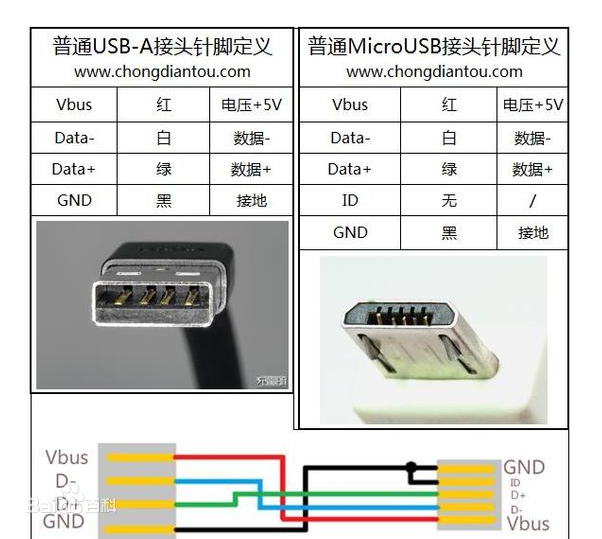
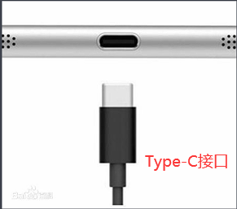

# github 日志

## 2024.01.24 周三

- 1、LQFP64L（16*16mm）和LQFP64S（12*12mm）

## 2024.01.23 周二

- 1、由于语音模块电路不能工作，最后验证单片机对语音电路是否正确（C9是否改为1uf，可以通过播放指示灯查看是否工作，闪烁为播放；MIX2002脚4和5需串联39k，将4脚翘起接39k），电路已验证，不可以解决问题；2、可尝试使用串口对模块发送相关命令，再用单片机对模块发送相关命令。

## 2024.01.15 周一

- 1、TC4056A输出电压与电池不一致问题，可能由于聚合物锂电池内置保护电路与外部冲突（去除DW01A），解决；
- dat<<=1;即dat=dat<<1;,将dat变量左移1位后的值赋给dat,结果会改变dat变量的值
- dat<<1;的带dat左移1位后的结果,并不会改变dat变量的值

## 2023.02.24 周五

- 1、由于STC12C5系列单片机取代STC89C5系列单片机，所以单片机选取STC12C5204ad；2、[STC官网](http://www.stcmcudata.com/)和[STC技术支持官网](https://www.stcai.com/)
## 2023.02.23 周四

- 安卓手机常用的两种接口为Micro USB和Type-C接口，其中Type-C接口为后续常用接口，在项目供电接口选取中选择Micro USB；并下载对应封装；
- 
- 

## 2023.02.22 周三

- 1、选取单片机厂家型号为STC89C52RC-40I-LQFP44，并下载对应封装；2、查询单片机数据手册可以看出STC89C52RC为5V单片机。
